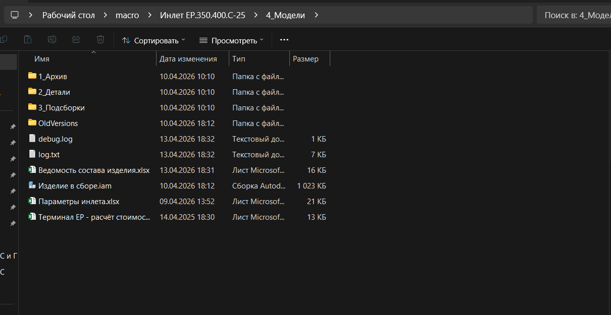
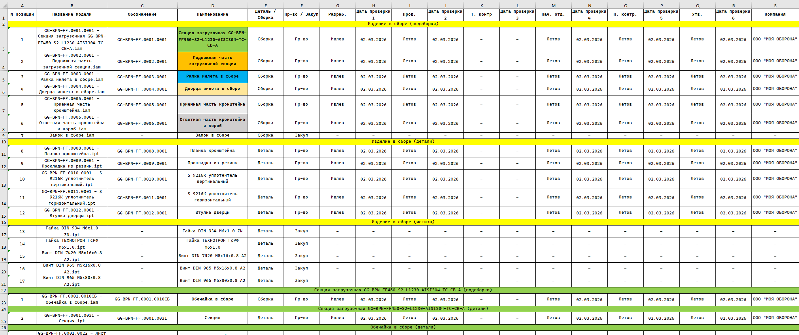
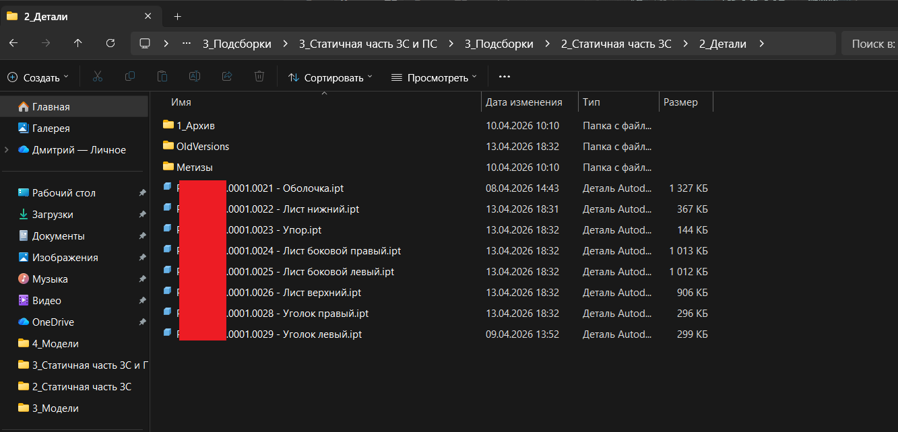
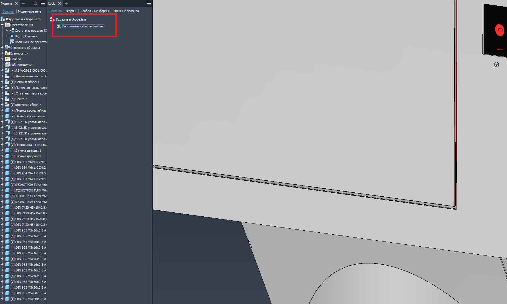
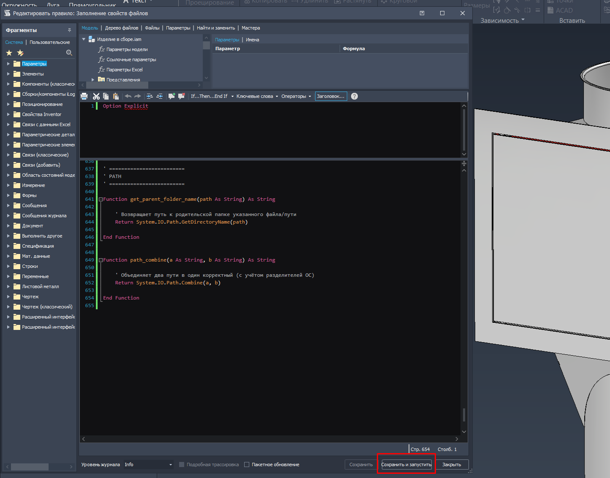
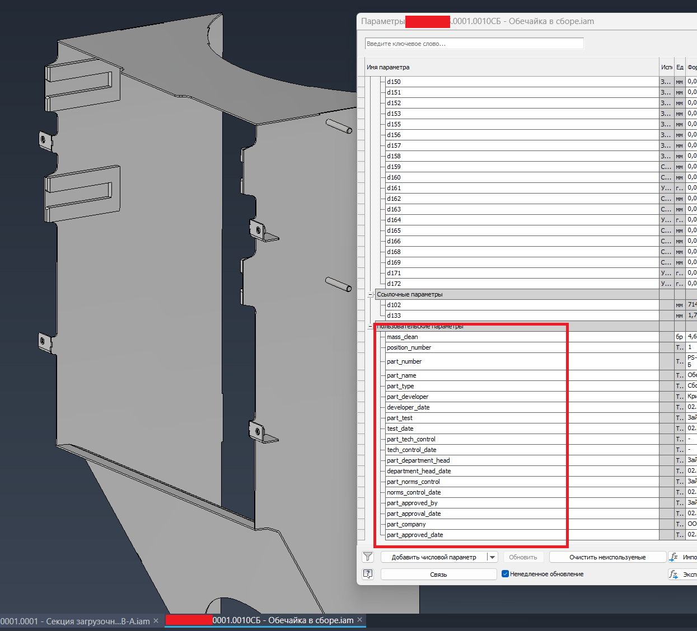
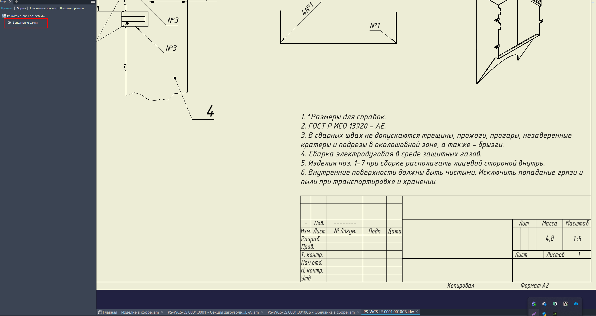
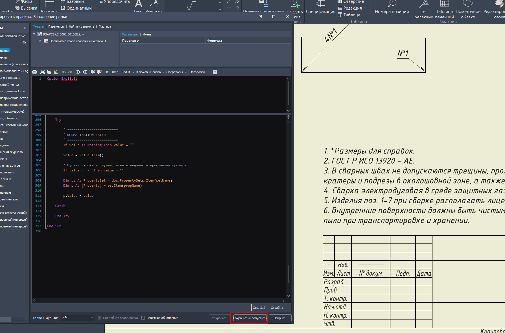
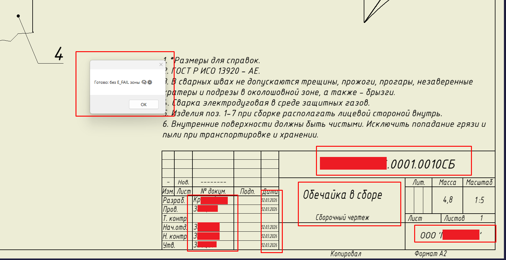
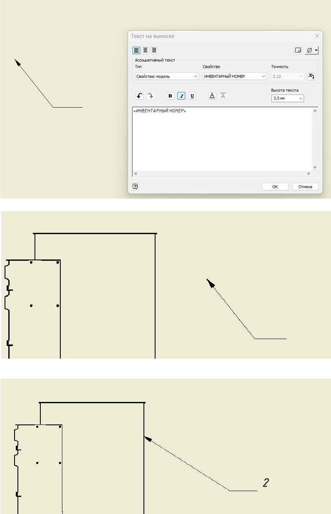

# Inventor drawings data fill

Пара макросов iLogic, предназначенных для автозаполнения данных о составных частях изделий, проектируемых в Inventor, из .xlsx - ведомости состава изделия и передачи данных в чертежи изделий для автозаполнения основных надписей и автонумерации позиционных обозначений (**ГОСТ / ЕСКД - формат**).

## Основные сведения

* Макрос работает **только** при использовании стандартного дерева моделей организации вида:

```

├───N_Модели
│   ├───0_Архив
│   ├───1_Детали
│   └───2_Подсборки
│       ├───1_Детали
│       └───2_Подсборки
|
| ...
|

```

* Макрос хранится в локальных правилах iLogic файла главной сборки изделия, размещенного в корневой папке (N_Модели) дерева моделей.

* Макрос запускается из файла главной сборки изделия, размещенного в корневой папке (N_Модели) дерева моделей.

* Таблица ведомости состава изделия размещается той же корневой папке (N_Модели) дерева моделей (название - "Ведомость состава изделия.xlsx").

* При **изменении данных **в таблице ведомости, **актуализации имён файлов** и **повторном запуске макроса** все модели и чертежи получают актуальные данные. Отображение данных на чертежах обновляется, согласно новым данным.


Основные сведения о макросах:

   * [Макрос для передачи данных в файлы деталей и сборок](https://github.com/dimakomplekt/IDDF_1.0/blob/main/description/file_data_desription.md)

   * [Макрос для передачи данных в файлы чертежей](https://github.com/dimakomplekt/IDDF_1.0/blob/main/description/drawing_parameters_get_desription.md)


## Пример работы (через последовательность формирования элементов)


#### Формирование корневой папки:

___



___


#### Заполнение таблицы ведомости (форма доступна в [ref](https://github.com/dimakomplekt/IDDF/ref](https://github.com/dimakomplekt/IDDF_1.0/tree/main/ref)):

___



___


#### Нейминг деталей и подсборок согласно ведомости:

___



___


#### Интеграция в основную сборку [правила 1](https://github.com/dimakomplekt/IDDF/src/file_data_fill.bas) путём копирования:

___



___


#### Выполнение правила 1:

___



___


#### Результат выполнения правила 1:

___



___


#### Интеграция [правила 2](https://github.com/dimakomplekt/IDDF/src/drawing_parameters_get.bas) в какой-либо чертеж путём копирования:

___



___


#### Выполнение правила 2:

___



___


#### Результат выполнения правила 2:

___



___


#### Автоматическая проставка позиционных обозначений через инвентарный номер:

___



___


## Примечания:

  * При необходимости вывод логов может быть отключен (оставлен базово для первичной отладки системы)
  * Файл ведомости может быть видоизменен (для обеспечения доп. функционала) путём добавления дополнительных листов - при изменении имени листа для части ведомости для парсинга необходимо заменить константу, отображающую имя листа части ведомости для парсинга (Dim SHEET_FOR_DATA_PARSE = "НА ПАРСИНГ" внутри файла file_data_fill.bas)
