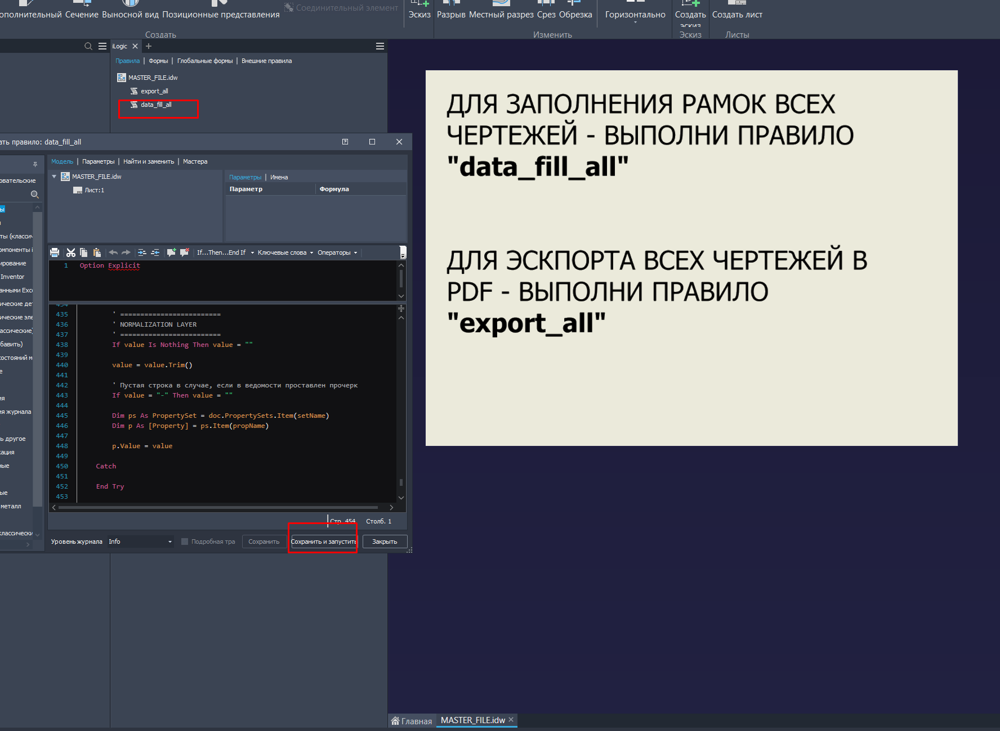

# Inventor drawings data fill

Три макроса iLogic, предназначенных для автозаполнения данных о составных частях изделий, проектируемых в Inventor, из .xlsx - ведомости состава изделия и передачи данных в чертежи изделий для автозаполнения основных надписей (**ГОСТ / ЕСКД - формат**).

* [Макрос 1](https://github.com/dimakomplekt/IDDF_1.0/blob/main/src/files_data_fill.bas) - предназначен для эскпорта данных из ведомости в .ipt и .iam файлы, входящие в изделие.
* [Макрос 2](https://github.com/dimakomplekt/IDDF_1.0/blob/main/src/drawing_parameters_get.bas) - предназначен для экспорта данных из .ipt и .iam файла модели в чертеж, соответствующий данной модели.
* [Макрос 3](https://github.com/dimakomplekt/IDDF_1.0/blob/main/src/all_drawings_parameters_get.bas) - предназначен для пакетного эспорта данных из всех .ipt и .iam файлов моделей в чертежи, соответствующие данным моделям.


## Основные сведения

* Макросы выгружаются путём копирования их текста в ["внутренние" правила iLogic](https://www.youtube.com/watch?v=Ej6ATlHl9Tg)
* Макрос 1 работает **только** при использовании стандартного дерева моделей организации вида:

```

├───N_Модели
│   ├───1_Архив
│   ├───2_Детали
│   └───3_Подсборки
│       ├───2_Детали
│       └───3_Подсборки
|
| ...
|

```

* Макрос 1 хранится в локальных правилах iLogic файла главной сборки изделия, размещенного в корневой папке (N_Модели) дерева моделей.

* Макрос 1 запускается из файла главной сборки изделия, размещенного в корневой папке (N_Модели) дерева моделей.

* Таблица ведомости состава изделия размещается той же корневой папке (N_Модели) дерева моделей (название - "Ведомость состава изделия.xlsx").

* Макрос 2 хранится в локальных правилах iLogic любого файла чертежа с привязкой к конкретной модели (модель на виде 1 листа 1).

* Макрос 2 запускается из любого файла чертежа с привязкой к конкретной модели (модель на виде 1 листа 1).
  
* Макрос 3 хранится в локальных правилах iLogic мастер-файла чертежа в корневой папки структуры хранения чертежей:

```

КОРЕНЬ_РЕД_ФОРМАТ
|
├── MASTER_FILE.idw (запускать макрос тут)
|
├── 1_Архив   ← игнорим
|
├── Пакет_1
│   ├── файл1.idw
│   ├── файл2.idw
│
├── Пакет_2
│   ├── файл3.idw
|
КОРЕНЬ_PDF_ФОРМАТ (где PDF раскладываются по подкаталогам, дублирующим структуру РФ)

```

* Макрос 3 запускается из мастер-файла чертежа в корневой папки структуры

* При **изменении данных** в таблице ведомости, **актуализации имён файлов** и **повторном запуске макроса** все модели и чертежи получают актуальные данные. Отображение данных на чертежах обновляется, согласно новым данным.


Основные сведения о макросах:

   * [Макрос для передачи данных в файлы деталей и сборок](https://github.com/dimakomplekt/IDDF_1.0/blob/main/description/file_data_desription.md)

   * [Макрос для передачи данных в конкретные файлы чертежей](https://github.com/dimakomplekt/IDDF_1.0/blob/main/description/drawing_parameters_get_desription.md)

   * [Макрос для передачи данных во все файлы чертежей в структуре](https://github.com/dimakomplekt/IDDF_1.0/blob/main/description/all_drawings_parameters_get_description.md)


## Пример работы (через последовательность формирования элементов)


#### Формирование корневой папки:

___


___


#### Заполнение таблицы ведомости (форма доступна в [ref](https://github.com/dimakomplekt/IDDF_1.0/blob/main/ref)):

___


___


#### Нейминг деталей и подсборок согласно ведомости (строгое совпадение с соответствующими ячейками "B"):

___


___


#### Интеграция в основную сборку [правила 1](https://github.com/dimakomplekt/IDDF_1.0/blob/main/src/file_data_fill.bas) путём копирования:

___


___


#### Выполнение правила 1:

___


___


#### Результат выполнения правила 1:

___


___


#### Интеграция [правила 2](https://github.com/dimakomplekt/IDDF_1.0/blob/main/src/drawing_parameters_get.bas) в какой-либо чертеж путём копирования:

___


___


#### Выполнение правила 2:

___


___


#### Результат выполнения правила 2:

___


___


#### Выполнение правила 3:

___



___


#### Результат выполнения правила 3 - вывод количества измененных файлов + заполненные рамки (как в результате работы правила 2)


___

## Примечания:

  * При необходимости вывод логов может быть отключен (оставлен базово для первичной отладки системы)
  * Файл ведомости может быть видоизменен (для обеспечения доп. функционала) путём добавления дополнительных листов - при изменении имени листа для части ведомости для парсинга необходимо заменить константу, отображающую имя листа части ведомости для парсинга (Dim SHEET_FOR_DATA_PARSE = "НА ПАРСИНГ" внутри файла file_data_fill.bas)

___


## Обязательно свяжитесь со мной при обнаружении багов.
